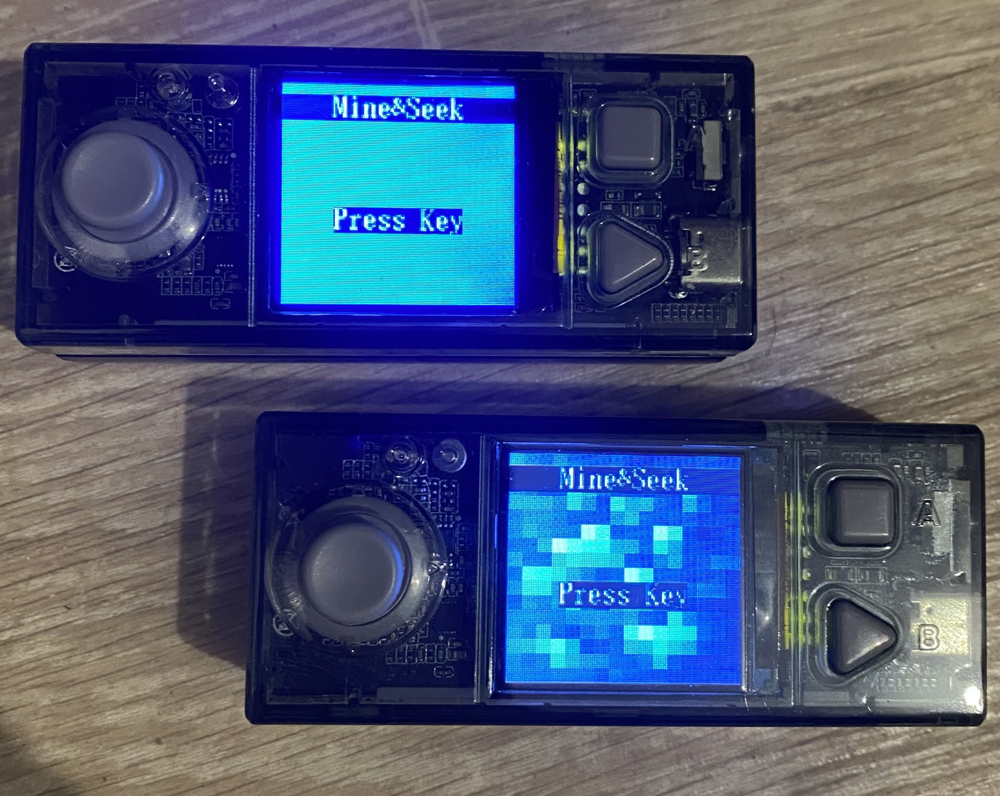
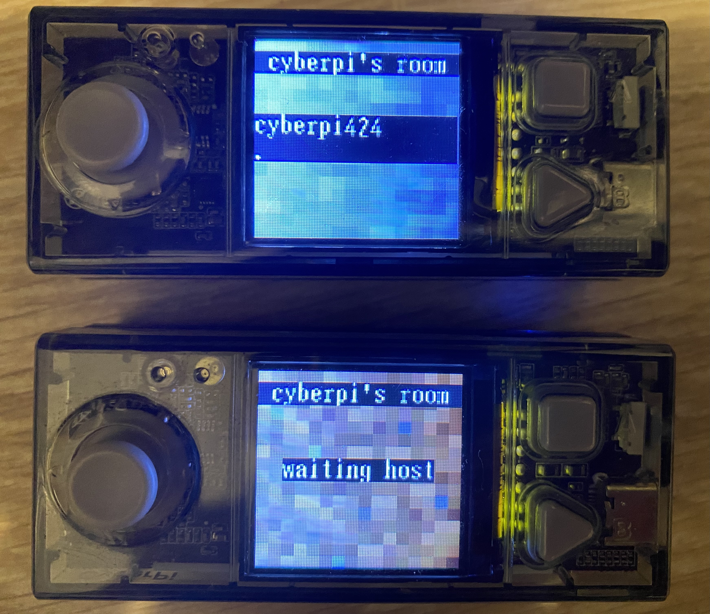
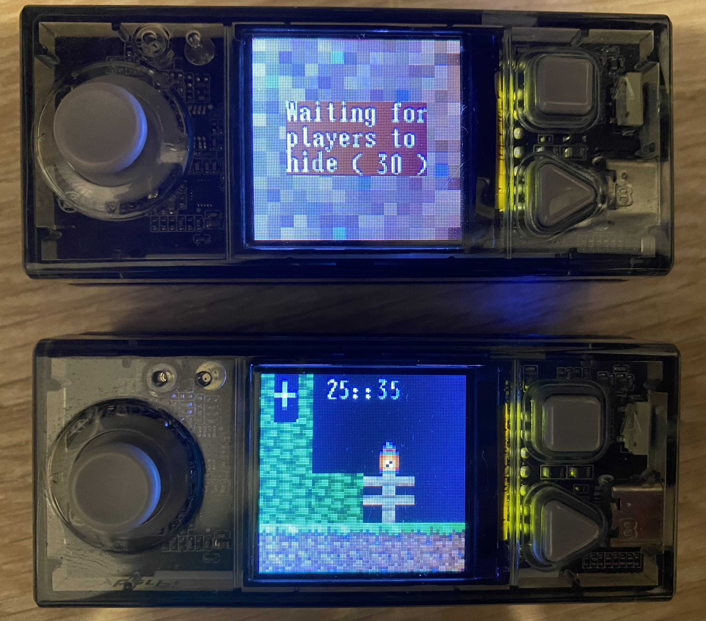

# [<Retour](../README.md) | Minecraft Hide&Seek / Prop Hunt

Minecraft Hide&Seek est un petit jeu multijoueurs fait pour Cyberpi, il n'y a pas de réelle limite de joueur (par partie) définie mais on peut se douter qu'il s'agît du maximum qu'un Cyberpi peut supporter.

# Installer le jeu

Vous avez deux solutions, soit aller directement à la [page du Jeu](https://planet.mblock.cc/project/4291628), soit importer depuis [Mblock](https://ide.mblock.cc/) ce [projet](./MinecraftHideAndSeek.mblock).

Quand vous avez ouvert le projet, et êtes bien à l'intérieur de celui ci (c'est à dire dans le code source), vous retrouverez en bas à gauche un bouton Appareils qui en cliquant dessus fera apparaître le code à importer dans l'appareil !

Vous pouvez retrouver un résumé bref de comment jouer depuis la [page du jeu](https://planet.mblock.cc/project/4291628)

# Apperçu

Après avoir choisi si vous souhaiter être Hôte ou Client, vous arriverez dans ce menu.

On a donc deux cyberpi connectés dans la même partie ! Il se peut qu'il soit nécessaire de réessayer de se connecter une deuxième fois si la connexion entre les appareils n'est pas bonne.

##

Projet réalisé par Idnewaill
